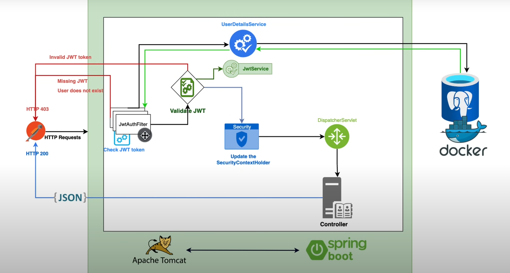

### About application



### Prerequisites

Create docker container for PostgreSQL:

```shell
docker run -d --name jwt-authentication-authorization -p 5432:5432 -e POSTGRES_PASSWORD=postgres postgres
```

Check if the container is running:

```shell
docker ps
```

Connect to the container:

```shell
docker exec -it jwt-authentication-authorization bash
```

Connect to the PostgreSQL:

```shell
psql -h localhost -U postgres
```

List all databases:

```shell
\l
```

Create a database:

```shell
CREATE DATABASE jwt_auth;
```
